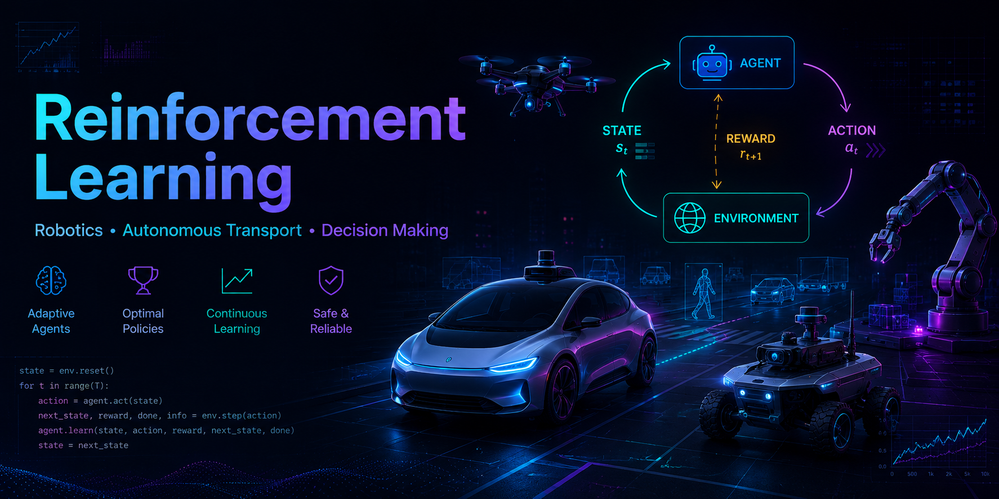

# 
 **Reinforcement-Learning-Projects**

Collection of my projects and experiments in **Reinforcement Learning** — from classic algorithms to modern deep RL approaches.

  

---

### 📁 Projects

- **[Deep Q-Network (DQN) Implementation](Deep-Q-Network-DQN/)**  
  Full implementation of Deep Q-Network with Experience Replay and Target Network. Tested on CartPole (debug) and Atari environments.

- **[Value Iteration & Policy Iteration](Classic-Algorithms.GridWorld-FrozenLake/)**  
  Implementation and comparison of two fundamental RL algorithms — Value Iteration and Policy Iteration — on Grid World and Frozen Lake environments (deterministic and stochastic).

- **[Imitation Learning: Behavioral Cloning & DAgger](Imitation-Learning.BC-DAgger/)**
  Implementation of Behavioral Cloning and DAgger algorithms. Demonstrated significant improvement of DAgger over BC by solving the covariate shift problem through iterative dataset aggregation.

- **[LunarLander with PPO, A2C and Reward Shaping](LunarLander-PPO-A2C-Reward-Shaping/)**
  Comparative study of PPO and A2C algorithms on LunarLander-v2 environment. Investigated the impact of custom reward shaping (fuel penalty) on training stability, fuel efficiency and final performance.

---

### 🛠 Technologies & Approaches

**Classical RL**
- Q-Learning, SARSA
- Value Iteration, Policy Iteration
- Monte Carlo methods

**Deep Reinforcement Learning**
- Deep Q-Network (DQN)
- Double DQN, Dueling DQN
- Policy Gradient methods (REINFORCE)
- Actor-Critic (A2C, A3C)
- Proximal Policy Optimization (PPO)

**Environments**
- OpenAI Gym / Gymnasium
- Custom environments
- Atari games, robotics simulations

**Tools**
- Python, PyTorch
- Stable-Baselines3
- Gymnasium, RLlib
- matplotlib, seaborn, plotly

---

### 🎯 Goals of the Repository

- Implement and compare different RL algorithms
- Solve classic and custom environments
- Experiment with deep RL techniques
- Understand exploration vs exploitation trade-offs
- Build stable and efficient RL agents

---

### 📫 How to Explore

Each project contains:
- Detailed `README.md`
- Full implementation and training code
- Training curves and evaluation metrics
- Environment descriptions
- `requirements.txt`

---

